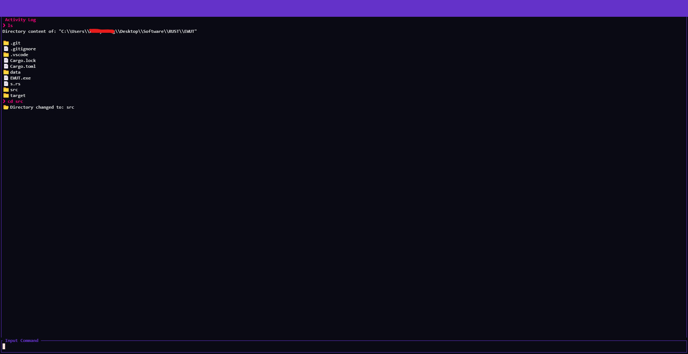
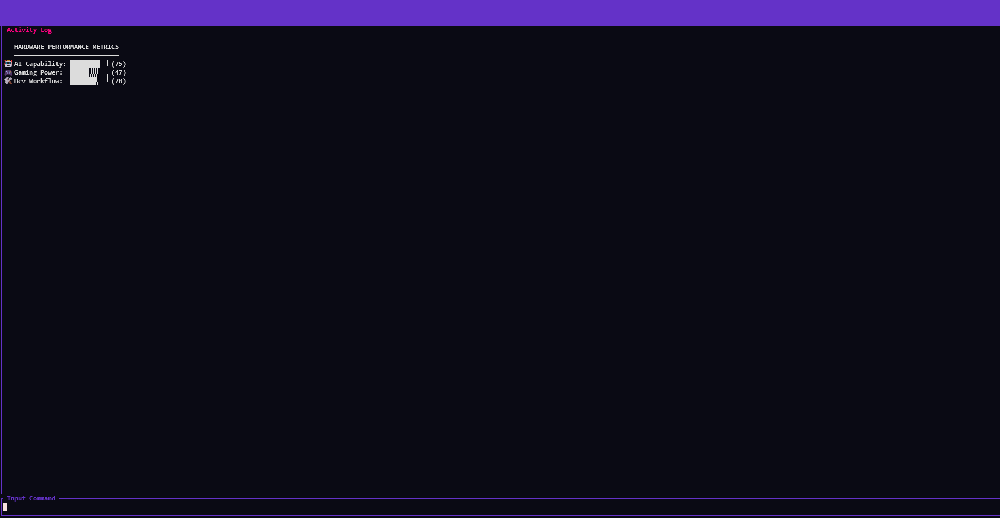

# ⚡ EWUT Terminal
> **Empowering Windows users with a high-performance, modern, and intuitive Terminal UI.**

EWUT (Enhanced Windows Universal Terminal) is a Rust-based terminal interface designed to streamline access to Windows commands while providing a sleek, Cyberpunk-inspired aesthetic. Built with **Ratatui**, it offers real-time hardware monitoring, advanced file system navigation, and a fully customizable theme engine.

---

## 📸 Preview
<p align="center">
  
  <br>
  <i>"A futuristic command-line experience for the modern power user."</i>
</p>

---

## ✨ Features

- **🚀 Instant Access:** Unified interface for all Windows system commands.
- **🛠️ Hardware Insights:** Real-time AI, Gaming, and Dev capability scoring powered by `hardware-query`.
- **🎨 Modern TUI:** Fully reactive UI with neon aesthetics and custom RGB themes.
- **📂 File Explorer:** Built-in directory navigation with modern iconography (📁/📄).
- **⚙️ Configurable:** Customize everything from window opacity to prompt symbols via `EWUT.toml`.

---

## 🛠️ Visual Tour

| **LS Command** | **System Score** |
| :---: | :---: |
|  |  |
| *Smart command dispatching logic* | *In-depth hardware performance metrics* |

---

## 🚀 Quick Start

### 1. Prerequisites
Ensure you have the latest **Rust** toolchain installed:
```bash
curl --proto '=https' --tlsv1.2 -sSf [https://sh.rustup.rs](https://sh.rustup.rs) | sh
